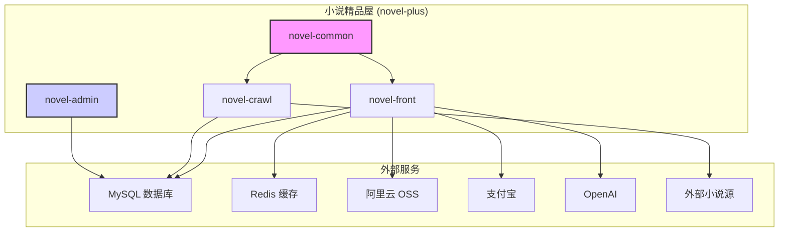

# 系统架构 (architecture.md)

`novel-plus` 采用基于 Spring Boot 的多模块 Maven 项目架构。整个系统被划分为四个主要的独立或半独立模块，以实现功能分离和解耦。

## 模块关系图

## 模块详解

*   **`novel-common` (通用模块)**
    *   **职责**: 作为项目的核心基础库，提供了所有模块共享的数据模型（Entities）、数据库访问层（DAO/Mapper）、通用工具类、核心配置和基础依赖。
    *   **源代码路径**: [`novel-common/`](novel-common/)
    *   **关键实现**: 封装了 `MyBatis`、`ShardingSphere` 和 `Redis` 的核心配置，为上层模块提供统一的数据访问接口。

*   **`novel-front` (前台门户模块)**
    *   **职责**: 面向最终用户的 Web 应用，提供小说阅读、搜索、支付、AI 写作等所有前台功能。
    *   **源代码路径**: [`novel-front/`](novel-front/)
    *   **关键实现**:
        *   依赖 `novel-common` 来访问数据。
        *   使用 Spring MVC 构建 RESTful API 和页面路由。
        *   通过 `Thymeleaf` 渲染动态页面，并支持多主题切换。
        *   集成 `Spring AI` 与 `OpenAI` API 交互，实现 AI 写作辅助。
        *   通过 `jjwt` 实现基于 Token 的用户认证。
        *   集成阿里云 OSS 和支付宝 SDK 分别处理文件存储和在线支付。

*   **`novel-crawl` (爬虫模块)**
    *   **职责**: 一个独立的后台应用程序，负责从配置的第三方网站自动抓取和更新小说内容。
    *   **源代码路径**: [`novel-crawl/`](novel-crawl/)
    *   **关键实现**:
        *   依赖 `novel-common` 将爬取的数据持久化到数据库。
        *   可能包含定时任务（如 `ScheduledExecutorService` 或 `Quartz`）来触发爬取过程。
        *   集成了邮件发送功能，用于任务状态通知。

*   **`novel-admin` (后台管理模块)**
    *   **职责**: 一个完全独立的 Web 应用，用于平台管理员管理整个系统的内容、用户和配置。
    *   **源代码路径**: [`novel-admin/`](novel-admin/)
    *   **架构特点**:
        *   **不依赖 `novel-common`**。它拥有自己独立的依赖集和 Spring Boot 版本，与前台系统完全解耦。这种设计增强了后台的稳定性，使其不受前台模块变更的影响。
        *   使用 **Apache Shiro** 进行精细的权限控制。
        *   直接连接数据库以管理数据。